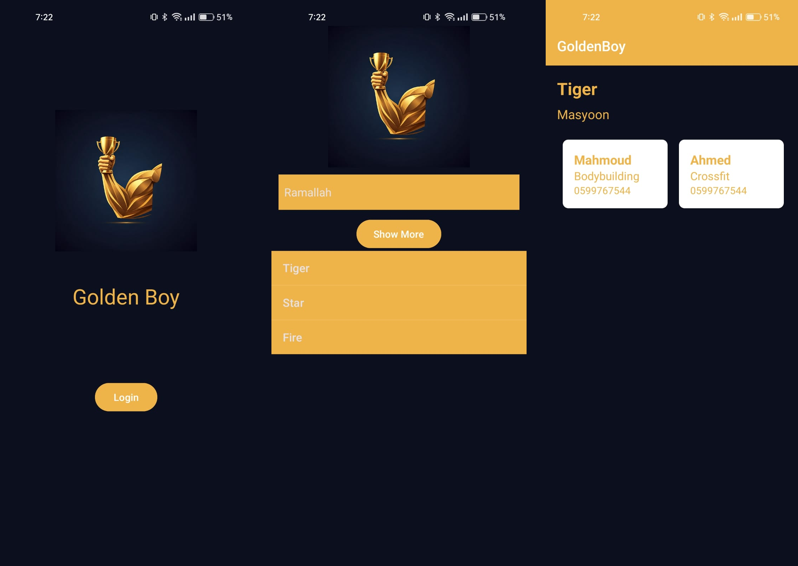

# Golden Boy: Health and Fitness App



This repository contains a health and fitness app to help users find gym coaches. This is part of my Mobile Development course (COMP4310). The project was created with Android Studio.

## Features

- Find gyms in different cities
- View gym details including name, address, and coaches
- Navigate to detailed information about each gym and its coaches

## Technologies Used

- Java
- Android Studio
- XML for layouts

## Project Structure

- `app/src/main/java/com/example/goldenboy/` - Contains the Java source files
  - `MainActivity.java` - The main entry point of the app
  - `SpinnerActivity.java` - Activity to select a city and view gyms
  - `GymDetailActivity.java` - Activity to view detailed information about a gym and its coaches
- `app/src/main/res/layout/` - Contains the XML layout files
  - `activity_main.xml` - Layout for the main activity
  - `activity_spinner.xml` - Layout for the spinner activity
  - `activity_gym_detail.xml` - Layout for the gym detail activity
  - `list_item.xml` - Custom layout for list view items
  - `spinner_dropdown_item.xml` - Custom layout for spinner dropdown items
- `app/src/main/AndroidManifest.xml` - Contains the app manifest file

## Getting Started

To get a local copy up and running, follow these steps:

1. Clone the repository:
   ```sh
   git clone https://https://github.com/Rasheed-Al-Qobbaj/GoldenBoy.git
   ```
2. Open the project in Android Studio.
3. Build and run the project on an emulator or physical device.

## Usage

1. Launch the app.
2. Select a city from the spinner.
3. Click on a gym from the list to view its details.
4. View the gym's name, address, and details of its coaches.

## Acknowledgements

- Thanks to Prof. Yousef Shahdeh and the Mobile Development course (COMP4310) for the guidance and support.